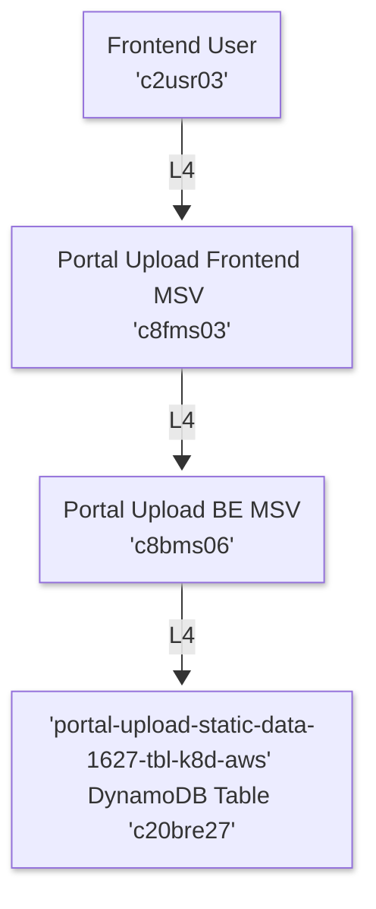

# Upload Image Legs:

* The **Image Upload Process** is analyzed across multiple **Legs**, each representing a distinct interaction between the **Frontend User**, **Frontend/Backend Microservices**, and **Backend Resources**. 
* Each **Leg** (e.g, `L4`, `L8`, `L12`) is further subdivided into parts (e.g, `P4`, `P8`, `P12`), detailing the specific **Start** and **End Resources** involved and the **Sequence of Operations**. 
* The **Process Identification (PID) Naming Convention** used is as follows: **`[Start Resource]-[End Resource]-[Execution Order]`**.

## Leg L4: Image Upload Static Data Retrieval

This **Leg** describes the complete flow of an **Image Upload Static Data Retrieval**, from the **Frontend User** interaction to the **Image Upload Static Data Retrieval**.

* **Part L4P4: User Interaction with Frontend Microservice**
    * The **PID** of **Part L4P4** is **`c2usr03-c8fms03-e05`**.
    * The **Start Resource** of **Part L4P4** is the **`c2usr03` Frontend User**.
    * The **End Resource** of **Part L4P4** is the **`c8fms03` Upload Image Frontend Microservice**.
    * The **Execution Order** of **Part L4P4** is `e05`.
    * **Description:** The **`c2usr03` Frontend User** interacts with the **`c8fms03` Upload Image Frontend Microservice UI** to initiate the **Image Upload Process**. This interaction triggers the subsequent steps in the flow.

* **Part L4P8: Frontend to Backend Microservice Communication**
    * The **PID** of **Part L4P8** is **`c8fms03-c8bms06-e10`**.
    * The **Start Resource** of **Part L4P8** is the **`c8fms03` Upload Image Frontend Microservice**.
    * The **End Resource** of **Part L4P8** is the **`c8bms06` Upload Image Backend Microservice**.
    * The **Execution Order** of **Part L4P8** is `e10`.
    * **Description:** The **`c8fms03` Upload Image Frontend Microservice** communicates with the **`c8bms06` Upload Image Backend Microservice** to retrieve **Static Data** required for the **Upload Process**.

* **Part L4P12: Backend Microservice Data Retrieval**
    * The **PID** of **Part L4P12** is **`c8bms06-c20bre27-e15`**.
    * The **Start Resource** of **Part L4P12** is the **`c8bms06` Upload Image Backend Microservice**.
    * The **End Resource** of **Part L4P12** is the **`c20bre27` DynamoDB Table**.
    * The **Execution Order** of **Part L4P12** is `e15`.
    * **Description:** The **`c8bms06` Upload Image Backend Microservice** queries the **`c20bre27` DynamoDB Table** to fetch the necessary **Image Upload Static Data**. This data is then returned to the **`c8fms03` Upload Image Frontend Microservice** for presentation to the **Frontend User**.

## Leg L8:

* **Part L8P4: TBD**
    * The **PID** of **Part L8P4** is **`c2usr03-c8fms03-e20`**.
    * The **Start Resource** of **Part L8P4** is the **`c2usr03` Frontend User**.
    * The **End Resource** of **Part L8P4** is the **`c8fms03` Upload Image Frontend Microservice**.
    * The **Execution Order** of **Part L8P4** is `e20`.
    * **Description:** TBD

* **Part L8P8: TBD**
    * The **PID** of **Part L8P8** is **`c8fms03-c12bms03-e25`**.
    * The **Start Resource** of **Part L8P8** is the **`c8fms03` Upload Image Frontend Microservice**.
    * The **End Resource** of **Part L8P8** is the **`c12bms03` Manifestor Image Validator Backend Microservice**.
    * The **Execution Order** of **Part L8P8** is `e25`.
    * **Description:** TBD

* **Part L8P12: TBD**
    * The **PID** of **Part L8P12** is **`c12bms03-c16bre03-e30`**.
    * The **Start Resource** of **Part L8P12** is the **`c12bms03` Manifestor Image Validator Backend Microservice**.
    * The **End Resource** of **Part L8P12** is the **`c16bre03` S3 Bucket `temporary-app-image-1203-bkt-k8d-aws`**.
    * The **Execution Order** of **Part L8P12** is `e30`.
    * **Description:** TBD

## Leg L12:

* **Part L12P4: TBD**
    * The **PID** of **Part L12P4** is **`c2usr03-c8fms03-e20`**.
    * The **Start Resource** of **Part L12P4** is the **`c2usr03` Frontend User**.
    * The **End Resource** of **Part L12P4** is the **`c8fms03` Upload Image Frontend Microservice**.
    * The **Execution Order** of **Part L12P4** is `e20`.
    * **Description:** TBD

* **Part L12P8: TBD**
    * The **PID** of **Part L12P8** is **`c8fms03-c12bms03-e25`**.
    * The **Start Resource** of **Part L12P8** is the **`c8fms03` Upload Image Frontend Microservice**.
    * The **End Resource** of **Part L12P8** is the **`c12bms03` Manifestor Image Validator Backend Microservice**.
    * The **Execution Order** of **Part L12P8** is `e25`.
    * **Description:** TBD

* **Part L12P12: TBD**
    * The **PID** of **Part L12P12** is **`c12bms03-c16bre06-e35`**.
    * The **Start Resource** of **Part L12P12** is the **`c12bms03` Manifestor Image Validator Backend Microservice**.
    * The **End Resource** of **Part L12P12** is the **`c16bre06` S3 Bucket `app-image-1206-bkt-k8d-aws`**.
    * The **Execution Order** of **Part L12P12** is `e35`.
    * **Description:** TBD

## Leg L16:

* **Part L16P4: TBD**
    * The **PID** of **Part L16P4** is **`c2usr03-c8fms03-e20`**.
    * The **Start Resource** of **Part L16P4** is the **`c2usr03` Frontend User**.
    * The **End Resource** of **Part L16P4** is the **`c8fms03` Upload Image Frontend Microservice**.
    * The **Execution Order** of **Part L16P4** is `e20`.
    * **Description:** TBD

* **Part L16P8: TBD**
    * The **PID** of **Part L16P8** is **`c8fms03-c12bms06-e40`**.
    * The **Start Resource** of **Part L16P8** is the **`c8fms03` Upload Image Frontend Microservice**.
    * The **End Resource** of **Part L16P8** is the **`c12bms06` Manifestor Save Metadata Backend Microservice**.
    * The **Execution Order** of **Part L16P8** is `e40`.
    * **Description:** TBD

* **Part L16P12: TBD**
    * The **PID** of **Part L16P12** is **`c12bms06-c20bre06-e45`**.
    * The **Start Resource** of **Part L16P12** is the **`c12bms06` Manifestor Save Metadata Backend Microservice**.
    * The **End Resource** of **Part L16P12** is the **`c20bre06` DynamoDB Table**.
    * The **Execution Order** of **Part L16P12** is `e45`.
    * **Description:** TBD

## Leg L20:

* **Part L20P4: TBD**
    * The **PID** of **Part L20P4** is **`c2usr03-c8fms03-e20`**.
    * The **Start Resource** of **Part L20P4** is the **`c2usr03` Frontend User**.
    * The **End Resource** of **Part L20P4** is the **`c8fms03` Upload Image Frontend Microservice**.
    * The **Execution Order** of **Part L20P4** is `e20`.
    * **Description:** TBD

* **Part L20P8: TBD**
    * The **PID** of **Part L20P8** is **`c8fms03-c12bms06-e40`**.
    * The **Start Resource** of **Part L20P8** is the **`c8fms03` Upload Image Frontend Microservice**.
    * The **End Resource** of **Part L20P8** is the **`c12bms06` Manifestor Save Metadata Backend Microservice**.
    * The **Execution Order** of **Part L20P8** is `e40`.
    * **Description:** TBD

* **Part L20P12: TBD**
    * The **PID** of **Part L20P12** is **`c12bms06-c20bre12-e50`**.
    * The **Start Resource** of **Part L20P12** is the **`c12bms06` Manifestor Save Metadata Backend Microservice**.
    * The **End Resource** of **Part L20P12** is the **`c20bre12` DynamoDB Table `user-data-1612-tbl-k8d-aws`**.
    * The **Execution Order** of **Part L20P12** is `e50`.
    * **Description:** TBD

## Leg L24:

* **Part L24P4: TBD**
    * The **PID** of **Part L24P4** is **`c2usr03-c8fms03-e20`**.
    * The **Start Resource** of **Part L24P4** is the **`c2usr03` Frontend User**.
    * The **End Resource** of **Part L24P4** is the **`c8fms03` Upload Image Frontend Microservice**.
    * The **Execution Order** of **Part L24P4** is `e20`.
    * **Description:** TBD

* **Part L24P8: TBD**
    * The **PID** of **Part L24P8** is **`c8fms03-c12bms06-e40`**.
    * The **Start Resource** of **Part L24P8** is the **`c8fms03` Upload Image Frontend Microservice**.
    * The **End Resource** of **Part L24P8** is the **`c12bms06` Manifestor Save Metadata Backend Microservice**.
    * The **Execution Order** of **Part L24P8** is `e40`.
    * **Description:** TBD

* **Part L24P12: TBD**
    * The **PID** of **Part L24P12** is **`c12bms06-c20bre15-e55`**.
    * The **Start Resource** of **Part L24P12** is the **`c12bms06` Manifestor Save Metadata Backend Microservice**.
    * The **End Resource** of **Part L24P12** is the **`c20bre15` DynamoDB Table `app-image-metadata-1615-tbl-k8d-aws`**.
    * The **Execution Order** of **Part L24P12** is `e55`.
    * **Description:** TBD

## Leg L24:

* **Part L24P4: TBD**
    * The **PID** of **Part L24P4** is **`c2usr03-c8fms03-e20`**.
    * The **Start Resource** of **Part L24P4** is the **`c2usr03` Frontend User**.
    * The **End Resource** of **Part L24P4** is the **`c8fms03` Upload Image Frontend Microservice**.
    * The **Execution Order** of **Part L24P4** is `e20`.
    * **Description:** TBD

* **Part L24P8: TBD**
    * The **PID** of **Part L24P8** is **`c8fms03-c12bms09-e60`**.
    * The **Start Resource** of **Part L24P8** is the **`c8fms03` Upload Image Frontend Microservice**.
    * The **End Resource** of **Part L24P8** is the **`c12bms09` Manifestor Chart Generator Backend Microservice**.
    * The **Execution Order** of **Part L24P8** is `e60`.
    * **Description:** TBD

* **Part L24P12: TBD**
    * The **PID** of **Part L24P12** is **`c12bms09-c20bre03-e65`**.
    * The **Start Resource** of **Part L24P12** is the **`c12bms09` Manifestor Chart Generator Backend Microservice**.
    * The **End Resource** of **Part L24P12** is the **`c20bre03` DynamoDB Table**.
    * The **Execution Order** of **Part L24P12** is `e65`.
    * **Description:** TBD

## Leg L32:

* **Part L32P4: TBD**
    * The **PID** of **Part L32P4** is **`c2usr03-c8fms03-e20`**.
    * The **Start Resource** of **Part L32P4** is the **`c2usr03` Frontend User**.
    * The **End Resource** of **Part L32P4** is the **`c8fms03` Upload Image Frontend Microservice**.
    * The **Execution Order** of **Part L32P4** is `e20`.
    * **Description:** TBD

* **Part L32P8: TBD**
    * The **PID** of **Part L32P8** is **`c8fms03-c12bms09-e60`**.
    * The **Start Resource** of **Part L32P8** is the **`c8fms03` Upload Image Frontend Microservice**.
    * The **End Resource** of **Part L32P8** is the **`c12bms09` Manifestor Chart Generator Backend Microservice**.
    * The **Execution Order** of **Part L32P8** is `e60`.
    * **Description:** TBD

* **Part L32P12: TBD**
    * The **PID** of **Part L32P12** is **`c12bms09-c20bre06-e70`**.
    * The **Start Resource** of **Part L32P12** is the **`c12bms09` Manifestor Chart Generator Backend Microservice**.
    * The **End Resource** of **Part L32P12** is the **`c20bre06` DynamoDB Table**.
    * The **Execution Order** of **Part L32P12** is `e70`.
    * **Description:** TBD

## Leg L36:

* **Part L36P4: TBD**
    * The **PID** of **Part L36P4** is **`c2usr03-c8fms03-e20`**.
    * The **Start Resource** of **Part L36P4** is the **`c2usr03` Frontend User**.
    * The **End Resource** of **Part L36P4** is the **`c8fms03` Upload Image Frontend Microservice**.
    * The **Execution Order** of **Part L36P4** is `e20`.
    * **Description:** TBD

* **Part L36P8: TBD**
    * The **PID** of **Part L36P8** is **`c8fms03-c12bms09-e60`**.
    * The **Start Resource** of **Part L36P8** is the **`c8fms03` Upload Image Frontend Microservice**.
    * The **End Resource** of **Part L36P8** is the **`c12bms09` Manifestor Chart Generator Backend Microservice**.
    * The **Execution Order** of **Part L36P8** is `e60`.
    * **Description:** TBD

* **Part L36P12: TBD**
    * The **PID** of **Part L36P12** is **`c12bms09-c20bre09-e75`**.
    * The **Start Resource** of **Part L36P12** is the **`c12bms09` Manifestor Chart Generator Backend Microservice**.
    * The **End Resource** of **Part L36P12** is the **`c20bre09` DynamoDB Table**.
    * The **Execution Order** of **Part L36P12** is `e75`.
    * **Description:** TBD

## Leg L40:

* **Part L40P4: TBD**
    * The **PID** of **Part L40P4** is **`c2usr03-c8fms03-e20`**.
    * The **Start Resource** of **Part L40P4** is the **`c2usr03` Frontend User**.
    * The **End Resource** of **Part L40P4** is the **`c8fms03` Upload Image Frontend Microservice**.
    * The **Execution Order** of **Part L40P4** is `e20`.
    * **Description:** TBD

* **Part L40P8: TBD**
    * The **PID** of **Part L40P8** is **`c8fms03-c12bms09-e60`**.
    * The **Start Resource** of **Part L40P8** is the **`c8fms03` Upload Image Frontend Microservice**.
    * The **End Resource** of **Part L40P8** is the **`c12bms09` Manifestor Chart Generator Backend Microservice**.
    * The **Execution Order** of **Part L40P8** is `e60`.
    * **Description:** TBD

* **Part L40P12: TBD**
    * The **PID** of **Part L40P12** is **`c12bms09-c20bre21-e80`**.
    * The **Start Resource** of **Part L40P12** is the **`c12bms09` Manifestor Chart Generator Backend Microservice**.
    * The **End Resource** of **Part L40P12** is the **`c20bre21` DynamoDB Table `user-event-log-1621-tbl-k8d-aws`**.
    * The **Execution Order** of **Part L40P12** is `e80`.
    * **Description:** TBD

## Leg L44:

* **Part L44P4: TBD**
    * The **PID** of **Part L44P4** is **`c2usr03-c8fms03-e20`**.
    * The **Start Resource** of **Part L44P4** is the **`c2usr03` Frontend User**.
    * The **End Resource** of **Part L44P4** is the **`c8fms03` Upload Image Frontend Microservice**.
    * The **Execution Order** of **Part L44P4** is `e20`.
    * **Description:** TBD

* **Part L44P8: TBD**
    * The **PID** of **Part L44P8** is **`c8fms03-c12bms09-e60`**.
    * The **Start Resource** of **Part L44P8** is the **`c8fms03` Upload Image Frontend Microservice**.
    * The **End Resource** of **Part L44P8** is the **`c12bms09` Manifestor Chart Generator Backend Microservice**.
    * The **Execution Order** of **Part L44P8** is `e60`.
    * **Description:** TBD

* **Part L44P12: TBD**
    * The **PID** of **Part L44P12** is **`c12bms09-c20bre24-e85`**.
    * The **Start Resource** of **Part L44P12** is the **`c12bms09` Manifestor Chart Generator Backend Microservice**.
    * The **End Resource** of **Part L44P12** is the **`c20bre24` DynamoDB Table `user-error-log-1624-tbl-k8d-aws`**.
    * The **Execution Order** of **Part L44P12** is `e85`.
    * **Description:** TBD

## Leg L48:

* **Part L48P4: TBD**
    * The **PID** of **Part L48P4** is **`c2usr03-c8fms03-e20`**.
    * The **Start Resource** of **Part L48P4** is the **`c2usr03` Frontend User**.
    * The **End Resource** of **Part L48P4** is the **`c8fms03` Upload Image Frontend Microservice**.
    * The **Execution Order** of **Part L48P4** is `e20`.
    * **Description:** TBD

* **Part L48P8: TBD**
    * The **PID** of **Part L48P8** is **`c8fms03-c8bms06-e90`**.
    * The **Start Resource** of **Part L48P8** is the **`c8fms03` Upload Image Frontend Microservice**.
    * The **End Resource** of **Part L48P8** is the **`c8bms06` Upload Image Backend Microservice**.
    * The **Execution Order** of **Part L48P8** is `e90`.
    * **Description:** TBD

* **Part L48P12: TBD**
    * The **PID** of **Part L48P12** is **`c8bms06-c32bre03-e95`**.
    * The **Start Resource** of **Part L48P12** is the **`c8bms06` Upload Image Backend Microservice**.
    * The **End Resource** of **Part L48P12** is the **`c32bre03` MySQL Database `app_image_mql_3203_dtb_k8d_aws`**.
    * The **Execution Order** of **Part L48P12** is `e95`.
    * **Description:** TBD